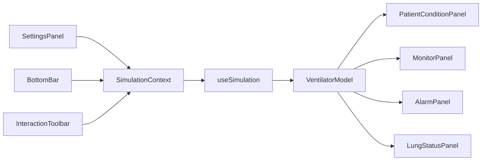

# Vent Simulator 2D Architecture

## Runtime Structure

The app is a single-page React/Vite simulator composed from four layers:

- `src/App.tsx`: screen composition only.
- `src/hooks/`: state orchestration for ventilator settings, elapsed time, and simulation memoization.
- `src/components/`: presentational UI panels, waveform charts, and patient visualization.
- `src/simulation/`: deterministic domain model for vitals, alarms, visual state, and condition messages.

## Data Flow

`SettingsPanel` and `BottomBar` emit user changes into `useVentilatorSettings`.
`useSimulation` recalculates derived simulation state from the selected scenario and current ventilator settings.
The derived state then fans out to the patient panel, lung panel, alarm panel, and monitor panel.

## Build Path

Development uses React directly. Production build aliases React to `preact/compat` in `vite.config.ts` to keep the JS bundle below the 60 KB target.

## React Pattern Decisions

- Form state that needs validation or import/export behavior is isolated from display state; `BottomBar` owns the time jump, time scale, and snapshot JSON fields through a dedicated reducer.
- Imperative refs are not part of the current component API. `forwardRef` remains out of scope until a parent component needs direct focus, measurement, or scrolling control over a child.
- Reusable panel framing uses the `Panel` compound component (`Panel.Aside`, `Panel.Heading`) so shared panel semantics and styling stay centralized.
- Render props and higher-order components are not used because the simulator does not expose cross-cutting component APIs that require runtime child rendering or wrapper injection. Hooks, context selectors, and plain props cover the current reuse points.
